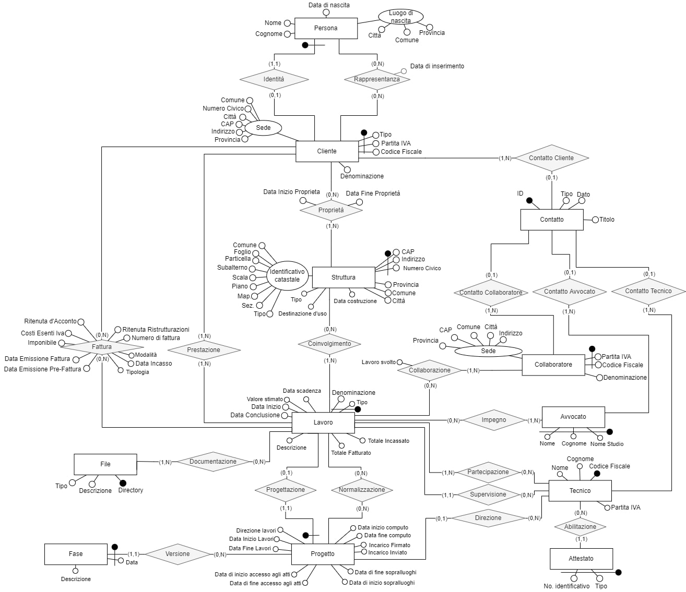

# pablitoBDB
This project was born as a university project. The main goal is designing and implementing a database from scratch, thus we decided to contact an engineering firm to work with them and improve their workflow. The reason we decided to contact them is the fact that they didn't work with any database, and designing a database for that enviroment is challenging. We like challenges.

You can find our [report](Report/Report.pdf) inside the [Report directory](Report/), unluckily it's written in italian cause our professor wanted it that way. Don't blame us, we might translate it soon. The report was written using Latex, in the Report directory you can find the [tex file](Report/Report.tex) too.

We used MySQL as DBMS, you can find the [database dump](SQL/dump.sql) inside the [SQL directory](SQL/), it contains fake data created using the python library [Faker](https://github.com/joke2k/faker), inside the SQL Directory you can find the [script](SQL/dummy.py) we wrote to create and insert the data.

The next goal of the project is designing and developing a web application and a management program that interface with the database, stay tuned!

Talking about the database, this is the database logic scheme:

# Contributors

Name | Email | GitHub | Contributing | LinkedIn 
--- | --- | --- | --- |--- 
Began Bajrami | <beganbajrami@outlook.it> |  [begbaj](https://github.com/begbaj) /  [dyrem](https://github.com/dyremm)| 
1/2
 | https://www.linkedin.com/in/begbaj/ 
Rahmi El Mechri | <rahmmi.elmechri@gmail.com>|  [OT-Rax](https://github.com/OT-Rax) | 
1/2
|https://www.linkedin.com/in/rahmi-elmechri/
